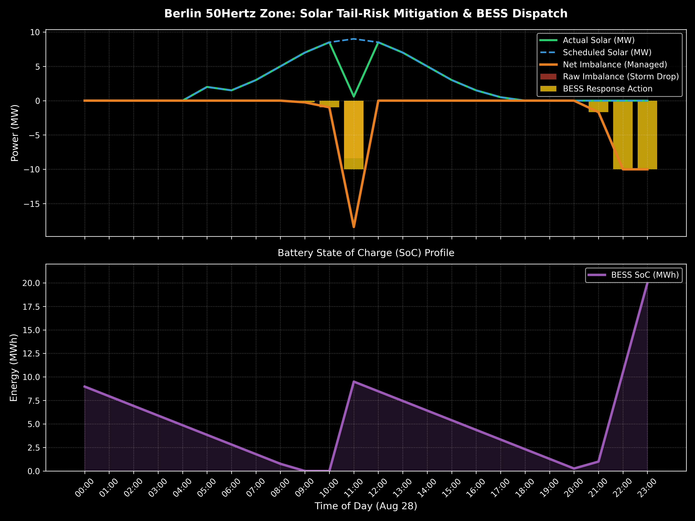
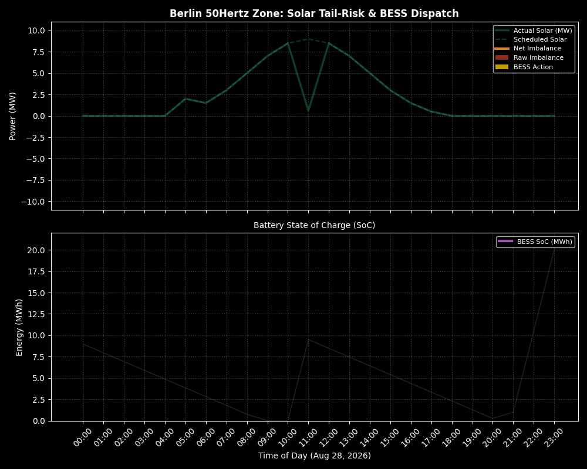

# ⚡ Berlin BESS Tail-Risk Optimizer & Solar Nowcasting

[](https://www.python.org/)
[](https://opensource.org/licenses/MIT)
[](https://coin-or.github.io/pulp/)
[](TBD_STREAMLIT_LINK_HERE)

## 🎯 Project Overview
This repository contains a professional-grade Python pipeline designed to optimize **Battery Energy Storage Systems (BESS)** dispatch within the German **50Hertz control area** (Berlin/Brandenburg region). 

Inspired by real-world market tail-risk events (such as sudden convective storm drops causing reBAP imbalance prices to spike up to **€3,730/MWh**), this project demonstrates how integrating a **15-minute Solar Nowcasting** warning signal with a linear programming optimization engine (`PuLP`) protects solar-plus-storage portfolios from catastrophic imbalance penalties.

---

## 🌐 Live Web Application
Explore the interactive simulation and real-time BESS optimization dashboard:
👉 **[Launch Streamlit Dashboard](TBD_STREAMLIT_LINK_HERE)** *(Coming Soon)*

---

## 📊 Key Results & Financial Impact (Tail-Risk Compression)

| Metric / Scenario | Without BESS & Nowcasting (Unmanaged) | With BESS + Nowcasting Optimization | Financial Benefit / Savings |
| :--- | :--- | :--- | :--- |
| **Hour 11 Solar Output** | 0.6 MW (Storm Drop from 9.0 MW) | 0.6 MW (Mitigated via BESS Action) | Maintain Portfolio Stability |
| **Market Clearing Mechanism** | Extreme reBAP Imbalance Penalty | Intraday VWAP Liquidity Clearing | Avoidance of Penalty Spikes |
| **Settlement Price** | **€3,730 / MWh** (Severe Penalty) | **€162 / MWh** (ID VWAP Rate) | Rate Compression |
| **Critical Hour Cost** | **~€31,332** loss | **~€1,360** cost | **~€29,972 Saved** in 1 hour |

---

## 📈 Static Optimization Pipeline Output
Here is the high-resolution static output showing the 24-hour solar profile, storm shock, BESS dispatch action, and State of Charge (SoC) trajectory:



---

## 🚀 Visualizing BESS Dispatch (Animated Dark-Theme Output)
Below is the animated simulation output generated by the pipeline, illustrating raw solar imbalance vs. BESS managed response and State of Charge (SoC) dynamics:



---

## 📂 Repository Structure
```text
Berlin-BESS-TailRisk-Optimizer/
│
├── data/                    # Historical and scenario solar datasets
│   └── 2026-08-28_berlin_solar.csv
│
├── notebooks/               # Jupyter notebook for interactive exploration
│   └── berlin_bess_tail_risk_optimizer.ipynb
│
├── src/                     # Modular source code
│   └── optimizer.py
│
├── tests/                   # Automated unit tests for pipeline validation
│   └── test_optimizer.py
│
├── outputs/                 # Visual outputs and animated demonstration
│   └── bess_optimization_animated.gif
│
├── app.py                   # Main standalone execution script
├── requirements.txt         # Project dependencies
└── README.md
